### Escuela Colombiana de Ingeniería
### Arquitecturas de Software - ARSW

## Escalamiento en Azure con Maquinas Virtuales, Sacale Sets y Service Plans
## Hann Jang

### Dependencias
* Cree una cuenta gratuita dentro de Azure. Para hacerlo puede guiarse de esta [documentación](https://azure.microsoft.com/es-es/free/students/). Al hacerlo usted contará con $100 USD para gastar durante 12 meses.

### Parte 0 - Entendiendo el escenario de calidad

Adjunto a este laboratorio usted podrá encontrar una aplicación totalmente desarrollada que tiene como objetivo calcular el enésimo valor de la secuencia de Fibonnaci.

**Escalabilidad**  
Cuando un conjunto de usuarios consulta un enésimo número (superior a 1000000) de la secuencia de Fibonacci de forma concurrente y el sistema se encuentra bajo condiciones normales de operación, todas las peticiones deben ser respondidas y el consumo de CPU del sistema no puede superar el 70%.

### Parte 1 - Escalabilidad vertical

1. __Diríjase a el [Portal de Azure](https://portal.azure.com/) y a continuación cree una maquina virtual con las características básicas descritas en la imágen 1 y que corresponden a las siguientes:__
    * __Resource Group = SCALABILITY_LAB__
    * __Virtual machine name = VERTICAL-SCALABILITY__
    * __Image = Ubuntu Server__
    * __Size = Standard B1ls__
    * __Username = scalability_lab__
    * __SSH publi key = Su llave ssh publica__
      

   


2. __Para conectarse a la VM use el siguiente comando, donde las `x` las debe remplazar por la IP de su propia VM (Revise la sección "Connect" de la virtual machine creada para tener una guía más detallada).__

    `ssh scalability_lab@xxx.xxx.xxx.xxx`

   Se realiza la conexión a la VM.  
   
    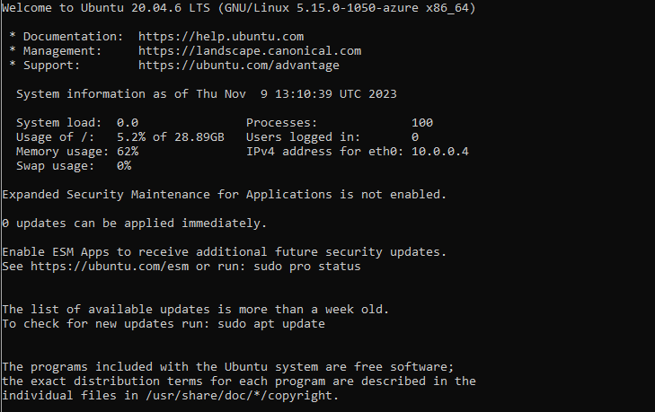


3. __Instale node, para ello siga la sección *Installing Node.js and npm using NVM* que encontrará en este [enlace](https://linuxize.com/post/how-to-install-node-js-on-ubuntu-18.04/).__    

   Se realiza la descarga indicada:
   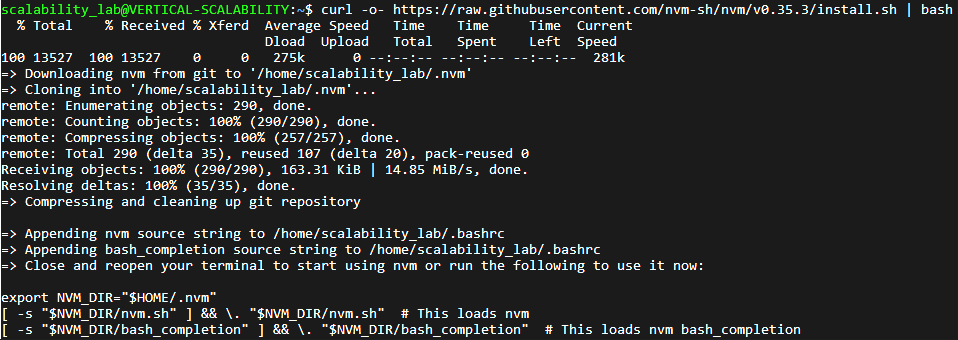

   Se instalamos node:  
   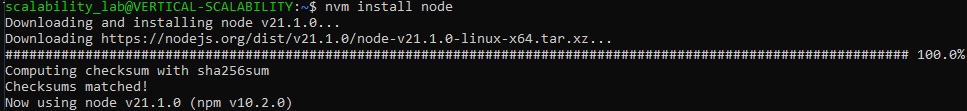 

   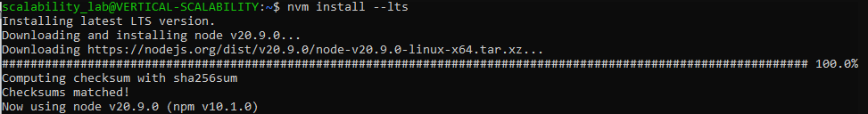

4. __Para instalar la aplicación adjunta al Laboratorio, suba la carpeta `FibonacciApp` a un repositorio al cual tenga acceso y ejecute estos comandos dentro de la VM:__

    `git clone <your_repo>`

    `cd <your_repo>/FibonacciApp`

    `npm install`

   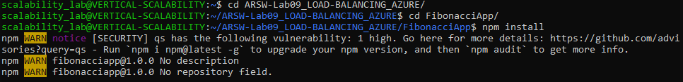


5. __Para ejecutar la aplicación puede usar el comando `npm FibinacciApp.js`, sin embargo una vez pierda la conexión ssh la aplicación dejará de funcionar. Para evitar ese compartamiento usaremos *forever*. Ejecute los siguientes comando dentro de la VM.__

    ` node FibonacciApp.js`

   Ejecutamos la aplicación:
   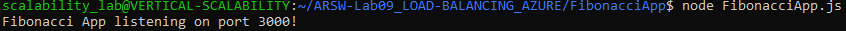


6. __Antes de verificar si el endpoint funciona, en Azure vaya a la sección de *Networking* y cree una *Inbound port rule* tal como se muestra en la imágen. Para verificar que la aplicación funciona, use un browser y user el endpoint `http://xxx.xxx.xxx.xxx:3000/fibonacci/6`. La respuesta debe ser `The answer is 8`.__

  

Configuración de la regla:  
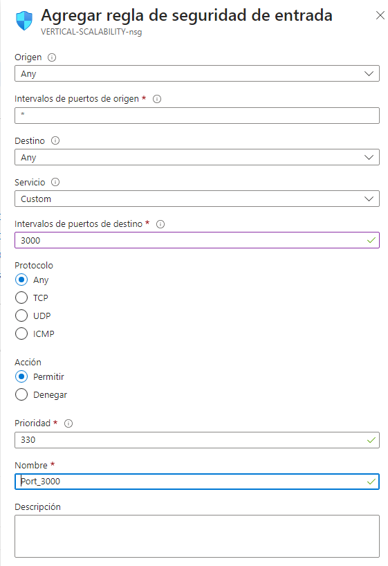

Se realiza la prueba:   
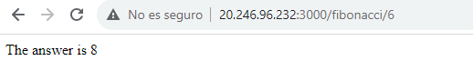

7. __La función que calcula en enésimo número de la secuencia de Fibonacci está muy mal construido y consume bastante CPU para obtener la respuesta. Usando la consola del Browser documente los tiempos de respuesta para dicho endpoint usando los siguintes valores:__  
    
    A continuación, se muestran los tiempos de respuesta:  
    * 1000000  
      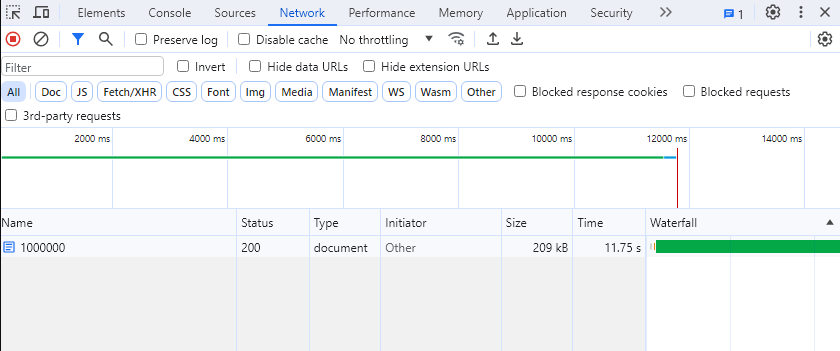

    * 1010000  
      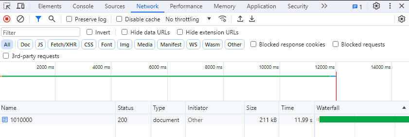

    * 1020000    
      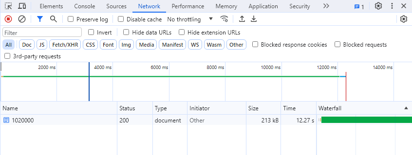

    * 1030000  
      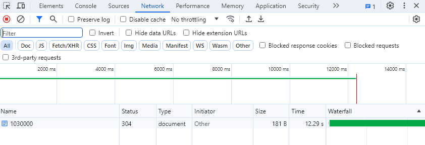

    * 1040000  
      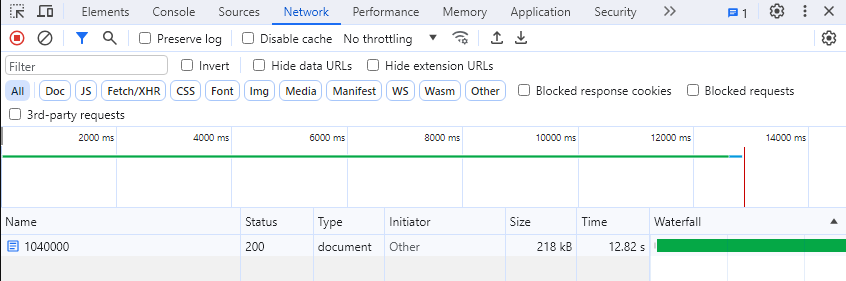

    * 1050000  
      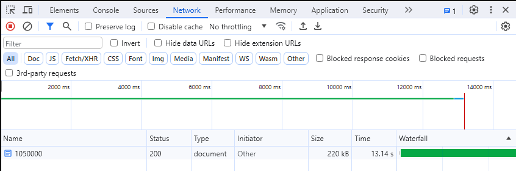

    * 1060000  
      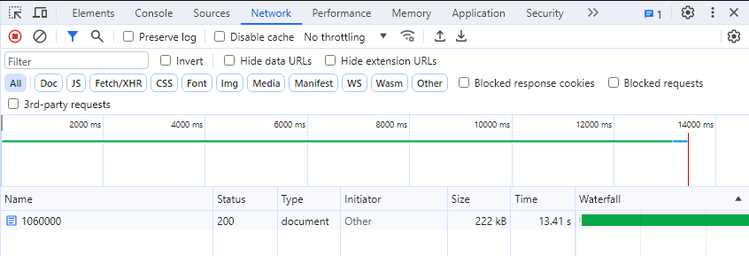
      
    * 1070000  
      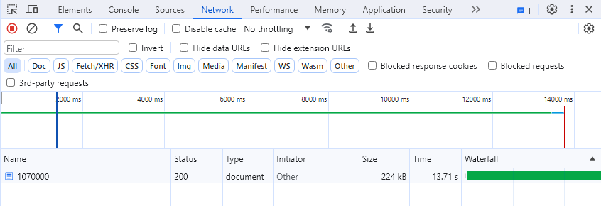

    * 1080000  
      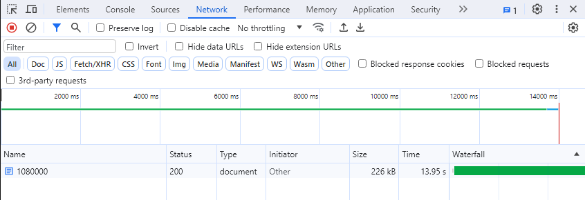 

    * 1090000  
      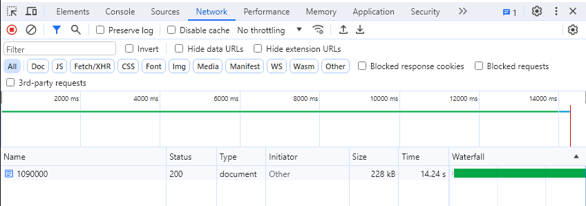

8. __Dírijase ahora a Azure y verifique el consumo de CPU para la VM. (Los resultados pueden tardar 5 minutos en aparecer).__  

  
Desde Azure, observamos el consumo de CPU de la máquina virtual en la última hora:  
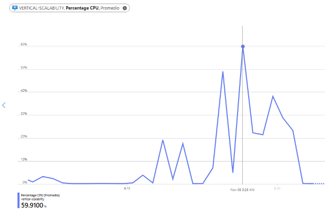
9. __Ahora usaremos Postman para simular una carga concurrente a nuestro sistema. Siga estos pasos.__
    * __Instale newman con el comando `npm install newman -g`. Para conocer más de Newman consulte el siguiente [enlace](https://learning.getpostman.com/docs/postman/collection-runs/command-line-integration-with-newman/).__
    * __Diríjase hasta la ruta `FibonacciApp/postman` en una maquina diferente a la VM.__
    * __Para el archivo `[ARSW_LOAD-BALANCING_AZURE].postman_environment.json` cambie el valor del parámetro `VM1` para que coincida con la IP de su VM.__
    * __Ejecute el siguiente comando.__  


  Se instala la version que requerimos:
  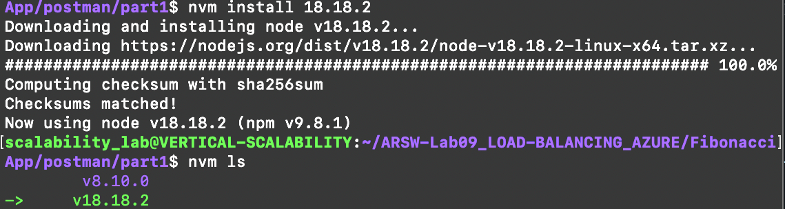
  
  Al ejecutar el comando obtenemos este resultado:
  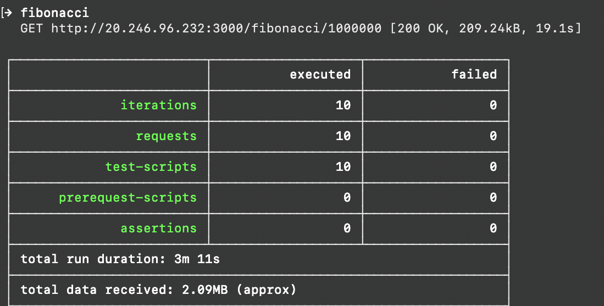

10. __La cantidad de CPU consumida es bastante grande y un conjunto considerable de peticiones concurrentes pueden hacer fallar nuestro servicio. Para solucionarlo usaremos una estrategia de Escalamiento Vertical. En Azure diríjase a la sección *size* y a continuación seleccione el tamaño `B2ms`.__  

11. __Una vez el cambio se vea reflejado, repita el paso 7, 8 y 9.__    
   Se repite el paso 7:  
   A continuación, se muestran los tiempos de respuesta:  

    Resultados: 
      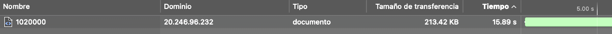
      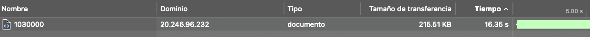
      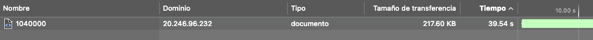
      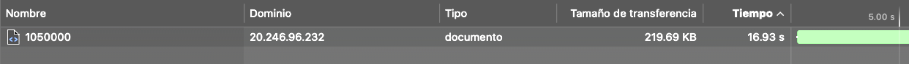
      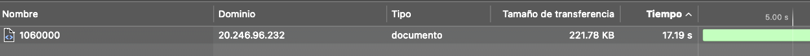
      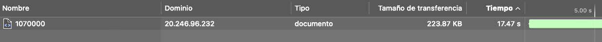
      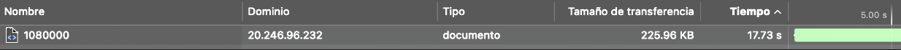
      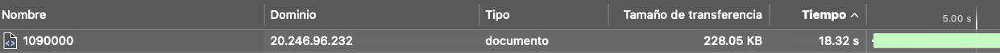

   Al repetir el paso 8:  
   Podemos que el consumo es de:
  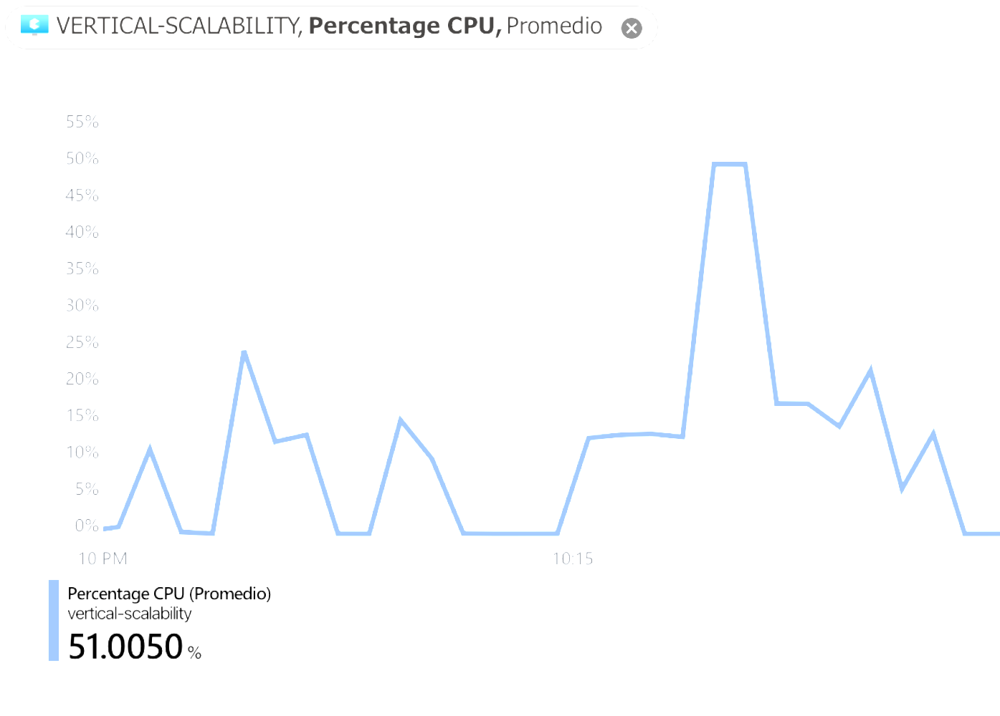

   Al repetir el paso 9:
   Al ejecutar el comando obtenemos este resultado:

   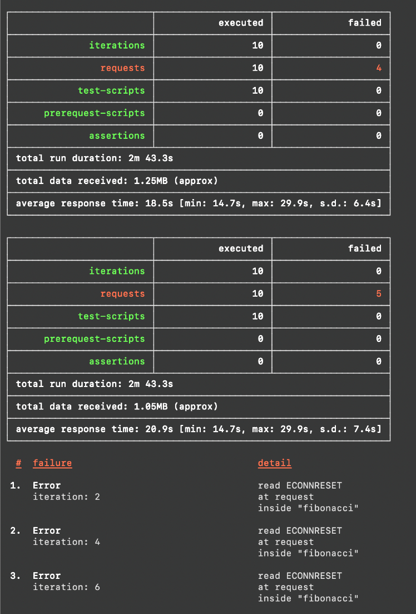
   


12. __Evalue el escenario de calidad asociado al requerimiento no funcional de escalabilidad y concluya si usando este modelo de escalabilidad logramos cumplirlo.__    
   
   Al utilizar el modelo de escalabilidad vertical, como se ve en los resultados no se pudo lograr cumplir el escenario de calidad. 
   
13. __Vuelva a dejar la VM en el tamaño inicial para evitar cobros adicionales.__


**Preguntas**

1. __¿Cuántos y cuáles recursos crea Azure junto con la VM?__
   Cuando se crea una VM se crea 7 recursos en total
2. __¿Brevemente describa para qué sirve cada recurso?__

  * **Máquina Virtual (VM):** En Azure, una máquina virtual es como un ordenador en la nube que funciona en los servidores de Azure.
   * **Dirección IP Pública:** Las máquinas virtuales pueden tener direcciones IP públicas o privadas, según lo que se necesite. Aquí, se configuró una IP pública para permitir el acceso desde Internet.
   * **Grupo de Seguridad de Red (NSG):** Es un conjunto de reglas que controlan el tráfico de red, permitiendo o bloqueando conexiones hacia y desde la máquina virtual dentro de una red en Azure.
   * **Red Virtual:** Crea un entorno de red privado para la máquina virtual, permitiendo que solo se comunique con recursos autorizados en la misma red, aumentando la seguridad y limitando el acceso desde fuera.
   * **Interfaz de Red:** Es un componente que conecta la máquina virtual a la red, asigna direcciones IP, y permite configurar opciones de seguridad y redirección de tráfico.
   * **Disco:** Son los dispositivos de almacenamiento para guardar datos de forma permanente en la máquina virtual. Azure ofrece discos administrados o no administrados.
   * **Clave SSH:** Es una herramienta que permite conectarse de forma segura a la máquina virtual para su gestión y uso. 

 

3. __¿Al cerrar la conexión ssh con la VM, por qué se cae la aplicación que ejecutamos con el comando `npm FibonacciApp.js`? ¿Por qué debemos crear un *Inbound port rule* antes de acceder al servicio?__  


    **Por qué se cae la aplicación al cerrar la conexión SSH:** Cuando ejecutas `npm FibonacciApp.js` a través de SSH, la aplicación corre dentro de esa sesión. Al cerrar la conexión, la sesión termina y también se detienen todos los programas que estaban en marcha, incluyendo la aplicación. Para que la aplicación siga funcionando, necesitaríamos usar algún método que la mantenga activa incluso después de cerrar la conexión, como `nohup` o `screen`.

    **Por qué necesitamos una regla de puerto de entrada (Inbound port rule):** Esta regla abre un puerto específico para permitir el acceso a la aplicación desde fuera de la máquina virtual. Azure, por seguridad, bloquea todas las conexiones externas por defecto, y solo deja pasar las que nosotros autoricemos. Sin esta regla, no podríamos acceder a la aplicación desde Internet porque Azure la estaría bloqueando.

4. __Adjunte tabla de tiempos e interprete por qué la función tarda tando tiempo.__  
   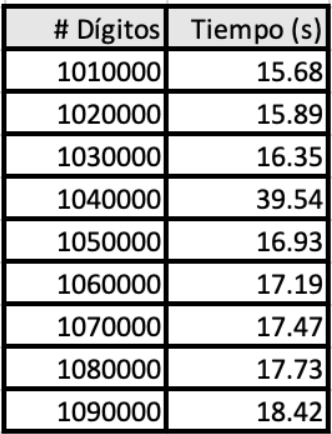


   La función es lenta porque se están calculando números de Fibonacci muy grandes. Solo hay una máquina con poca capacidad haciéndolo, así que le toma tiempo y esfuerzo responder a cada solicitud.

6. __Adjunte imágen del consumo de CPU de la VM e interprete por qué la función consume esa cantidad de CPU.__  

   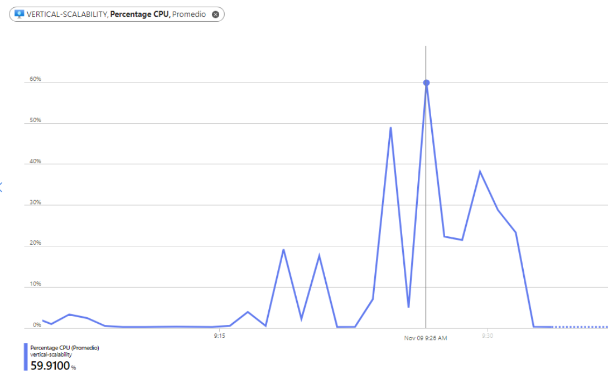

   Esto ocuere porque consume bastante CPU llegando al limite.
   
7. __Adjunte la imagen del resumen de la ejecución de Postman. Interprete:__  
    * __Tiempos de ejecución de cada petición.__  
    * __Si hubo fallos documentelos y explique.__    
   
   En el desarrollo del laboratorio de dieron las pruebas. Al agregarse la escalabilidad podemos darnos cuenta que los tiempos de ejecución no nuestran un cambio mayor.
   
8. __¿Cuál es la diferencia entre los tamaños `B2ms` y `B1ls` (no solo busque especificaciones de infraestructura)?__  
   
    La diferencia entre los tamaños `B2ms` y `B1ls` en Azure está en la **capacidad de recursos** que ofrecen, como potencia de procesamiento (CPU) y memoria (RAM).

    - **`B2ms`** es más potente: tiene **más CPU y memoria** en comparación con `B1ls`. Esto significa que puede manejar aplicaciones más pesadas o varias tareas al mismo tiempo sin disminuir mucho su rendimiento. Es útil para aplicaciones que necesitan realizar más trabajo o responder a muchos usuarios a la vez.

    - **`B1ls`** es mucho más pequeño: tiene **menos CPU y memoria**. Está pensado para tareas muy básicas, como pequeñas pruebas o aplicaciones ligeras que no necesitan mucha capacidad. Si intentas ejecutar algo complejo en `B1ls`, probablemente será lento o podría fallar.

    En resumen, `B2ms` es más rápido y capaz que `B1ls`, y está pensado para manejar trabajos más grandes. `B1ls` es económico y adecuado para tareas simples.


9. __¿Aumentar el tamaño de la VM es una buena solución en este escenario?, ¿Qué pasa con la FibonacciApp cuando cambiamos el tamaño de la VM?__  
    **¿Aumentar el tamaño de la VM es una buena solución en este escenario?**

    Aumentar el tamaño de la VM puede ayudar en el corto plazo porque le da más capacidad de procesamiento y memoria para manejar los cálculos de la aplicación `FibonacciApp`. Esto podría hacer que la aplicación responda más rápido, ya que la VM tendría más recursos para realizar los cálculos de Fibonacci.

    Sin embargo, no siempre es la mejor solución a largo plazo, ya que:

    - **Es costoso**: Aumentar el tamaño de la VM puede incrementar significativamente los costos.
    - **Escalabilidad limitada**: Si la cantidad de usuarios o solicitudes sigue creciendo, solo aumentar el tamaño de la VM podría no ser suficiente. En ese caso, una mejor solución sería usar múltiples máquinas (escalado horizontal) o una arquitectura que distribuya las solicitudes entre varias VMs.

    **¿Qué pasa con la `FibonacciApp` cuando cambiamos el tamaño de la VM?**

      Al cambiar el tamaño de la VM, la máquina virtual necesita reiniciarse, por lo que cualquier aplicación en ejecución, como `FibonacciApp`, se detendrá. Después del cambio de tamaño, deberás volver a iniciar `FibonacciApp` para que vuelva a estar disponible. 

10. __¿Qué pasa con la infraestructura cuando cambia el tamaño de la VM? ¿Qué efectos negativos implica?__  
    
      Al cambiar el tamaño de una VM en Azure, ocurren ciertos efectos en la infraestructura que pueden tener consecuencias negativas:

      Primero, la VM necesita reiniciarse para aplicar el nuevo tamaño, lo cual interrumpe cualquier aplicación en ejecución, como `FibonacciApp`. Esto significa que el servicio se detiene temporalmente y deberá reiniciarse manualmente una vez completado el cambio.

      Además, si la VM usa una dirección IP pública dinámica, esta podría cambiar tras el reinicio, lo que afecta la forma en que los usuarios se conectan al servicio. Para evitar esto, se recomienda usar una IP estática si la VM necesita un acceso constante.

      También, el cambio de tamaño implica una asignación distinta de recursos, como CPU, memoria y almacenamiento, lo que puede incrementar los costos de operación. Si el nuevo tamaño es más grande de lo necesario, es posible que se incurra en gastos adicionales sin aprovechar completamente los recursos.

      Por último, en algunos casos, ciertas configuraciones de red o almacenamiento pueden requerir ajustes adicionales al modificar el tamaño de la VM, lo que añade complejidad al proceso y puede requerir más tiempo de configuración.    

11. __¿Hubo mejora en el consumo de CPU o en los tiempos de respuesta? Si/No ¿Por qué?__  
    
    No hubo una mejora en el consumo de CPU o en los tiempos porque cada peticion consume muchos recusos y al mandar varias al timepo, causa que no se pueda cumplir con un escenario de calidad.
       
12. __Aumente la cantidad de ejecuciones paralelas del comando de postman a `4`. ¿El comportamiento del sistema es porcentualmente mejor?__  
   
   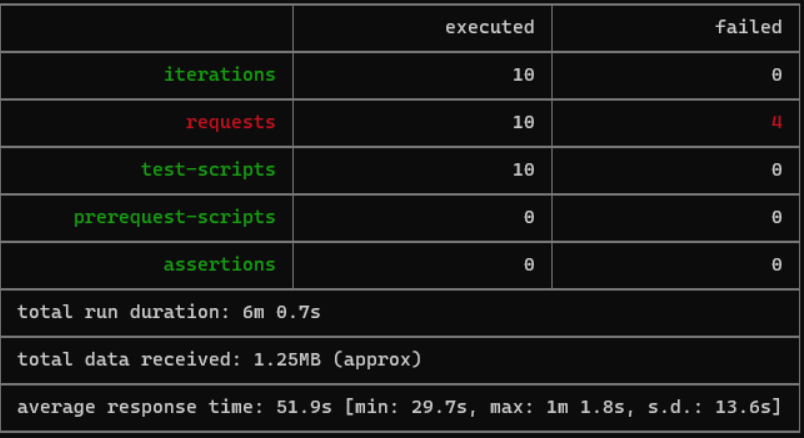
   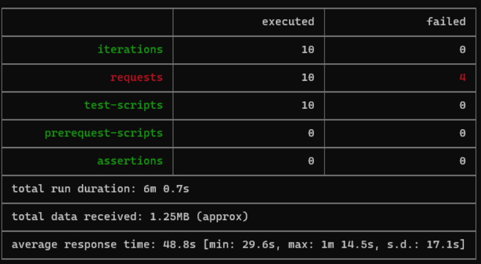
   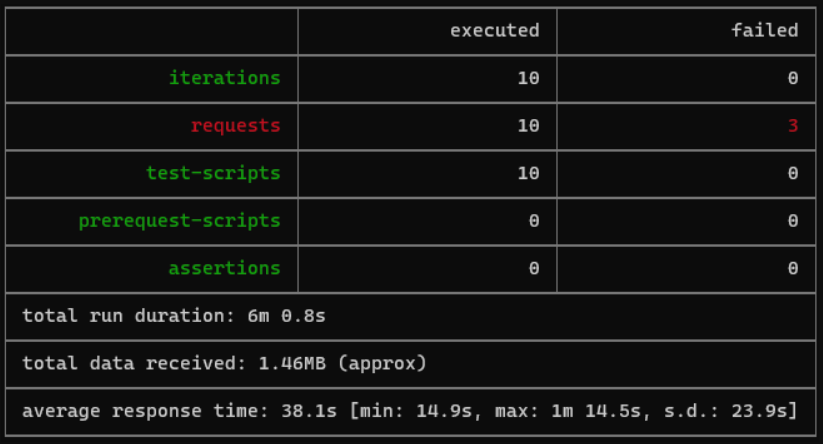
   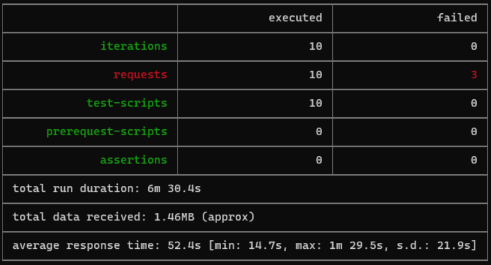
   
   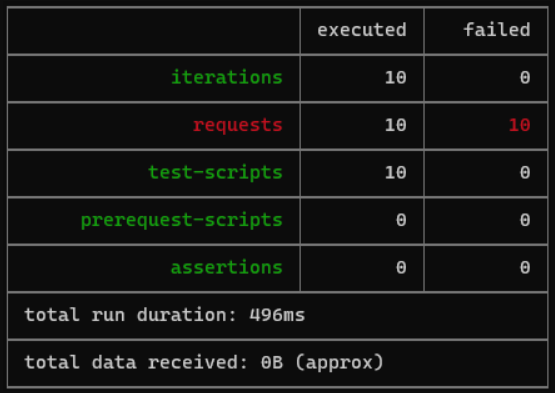
   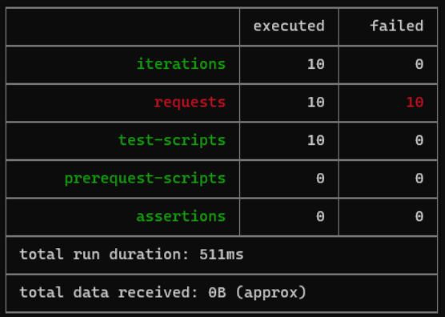
   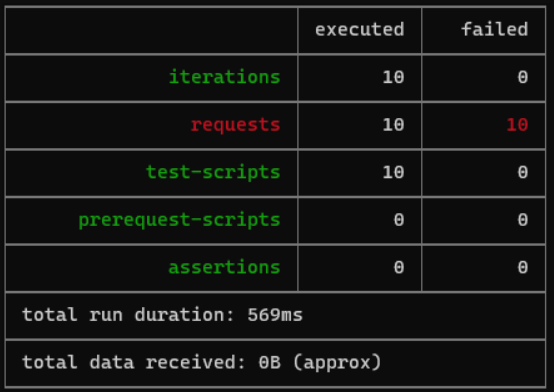
   

  Podemos ver el el consumo disminuyo, pero tambien tenemos un aumento en los errores. 


### Parte 2 - Escalabilidad horizontal

#### Crear el Balanceador de Carga

Antes de continuar puede eliminar el grupo de recursos anterior para evitar gastos adicionales y realizar la actividad en un grupo de recursos totalmente limpio.

1. El Balanceador de Carga es un recurso fundamental para habilitar la escalabilidad horizontal de nuestro sistema, por eso en este paso cree un balanceador de carga dentro de Azure tal cual como se muestra en la imágen adjunta.

  

Creación del balanceador:

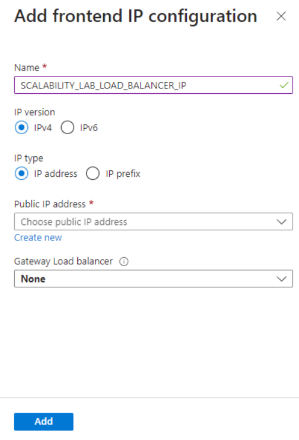


2. A continuación cree un *Backend Pool*, guiese con la siguiente imágen.


3. A continuación cree un *Health Probe*, guiese con la siguiente imágen.


El Health Probe ahora se crea en el mismo instante de crear un Loas 

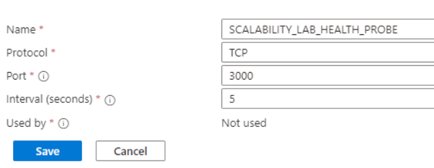


4. A continuación cree un *Load Balancing Rule*, guiese con la siguiente imágen.

  
Se crea el Load Balancing Rule como se especificó:  


5. Cree una *Virtual Network* dentro del grupo de recursos, guiese con la siguiente imágen.


#### Crear las maquinas virtuales (Nodos)

Ahora vamos a crear 3 VMs (VM1, VM2 y VM3) con direcciones IP públicas standar en 3 diferentes zonas de disponibilidad. Después las agregaremos al balanceador de carga.

1. En la configuración básica de la VM guíese por la siguiente imágen. Es importante que se fije en la "Avaiability Zone", donde la VM1 será 1, la VM2 será 2 y la VM3 será 3.


2. En la configuración de networking, verifique que se ha seleccionado la *Virtual Network*  y la *Subnet* creadas anteriormente. Adicionalmente asigne una IP pública y no olvide habilitar la redundancia de zona.


3. Para el Network Security Group seleccione "avanzado" y realice la siguiente configuración. No olvide crear un *Inbound Rule*, en el cual habilite el tráfico por el puerto 3000. Cuando cree la VM2 y la VM3, no necesita volver a crear el *Network Security Group*, sino que puede seleccionar el anteriormente creado.


4. Ahora asignaremos esta VM a nuestro balanceador de carga, para ello siga la configuración de la siguiente imágen.


5. __ Finalmente debemos instalar la aplicación de Fibonacci en la VM. para ello puede ejecutar el conjunto de los siguientes comandos, cambiando el nombre de la VM por el correcto__

```
git clone https://github.com/daprieto1/ARSW_LOAD-BALANCING_AZURE.git

curl -o- https://raw.githubusercontent.com/creationix/nvm/v0.34.0/install.sh | bash
source /home/vm1/.bashrc
nvm install node

cd ARSW_LOAD-BALANCING_AZURE/FibonacciApp
npm install

npm install forever -g
forever start FibonacciApp.js
```

__Realice este proceso para las 3 VMs, por ahora lo haremos a mano una por una, sin embargo es importante que usted sepa que existen herramientas para aumatizar este proceso, entre ellas encontramos Azure Resource Manager, OsDisk Images, Terraform con Vagrant y Paker, Puppet, Ansible entre otras.__


#### Probar el resultado final de nuestra infraestructura

1. __Porsupuesto el endpoint de acceso a nuestro sistema será la IP pública del balanceador de carga, primero verifiquemos que los servicios básicos están funcionando, consuma los siguientes recursos:__

```
http://52.155.223.248/
http://52.155.223.248/fibonacci/1
```

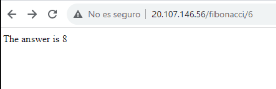

2. __Realice las pruebas de carga con `newman` que se realizaron en la parte 1 y haga un informe comparativo donde contraste: tiempos de respuesta, cantidad de peticiones respondidas con éxito, costos de las 2 infraestrucruras, es decir, la que desarrollamos con balanceo de carga horizontal y la que se hizo con una maquina virtual escalada.__

Podemos ver una mejora en el rendimiento en una infraestructura horizontal al ver que solo 3 peticiones solicitadas no fueron exitosas. Al compararlas con la infraestructura vertical salieron 9 fallos de peticiones. 

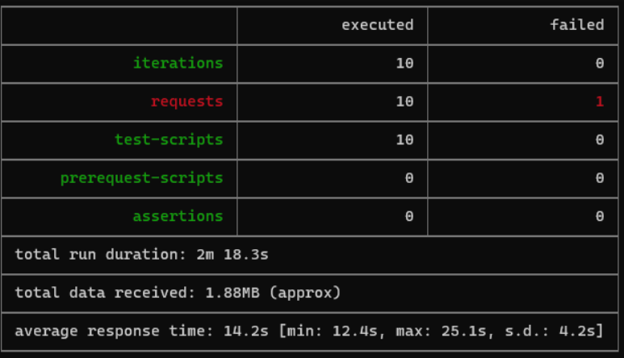

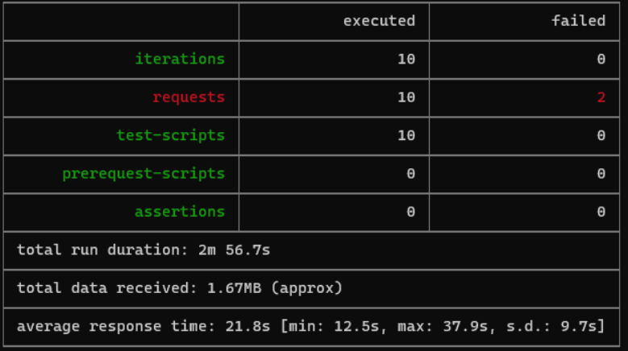
 
4. __Agregue una 4 maquina virtual y realice las pruebas de newman, pero esta vez no lance 2 peticiones en paralelo, sino que incrementelo a 4. Haga un informe donde presente el comportamiento de la CPU de las 4 VM y explique porque la tasa de éxito de las peticiones aumento con este estilo de escalabilidad.__

```
newman run ARSW_LOAD-BALANCING_AZURE.postman_collection.json -e [ARSW_LOAD-BALANCING_AZURE].postman_environment.json -n 10 &
newman run ARSW_LOAD-BALANCING_AZURE.postman_collection.json -e [ARSW_LOAD-BALANCING_AZURE].postman_environment.json -n 10 &
newman run ARSW_LOAD-BALANCING_AZURE.postman_collection.json -e [ARSW_LOAD-BALANCING_AZURE].postman_environment.json -n 10 &
newman run ARSW_LOAD-BALANCING_AZURE.postman_collection.json -e [ARSW_LOAD-BALANCING_AZURE].postman_environment.json -n 10
```
Este paso no se pudo realizar porque hay un limite en la categoria de estudiante.

**Preguntas**

* __¿Cuáles son los tipos de balanceadores de carga en Azure y en qué se diferencian?, ¿Qué es SKU, qué tipos hay y en qué se diferencian?, ¿Por qué el balanceador de carga necesita una IP pública?__  
   **¿Cuáles son los tipos de balanceadores de carga en Azure y en qué se diferencian?**

    En Azure, existen principalmente dos tipos de balanceadores de carga:

    - **Balanceador de Carga Público**: Distribuye el tráfico de Internet hacia los recursos internos en Azure, como máquinas virtuales o grupos de máquinas. Se usa cuando los recursos necesitan ser accesibles desde fuera de la red de Azure, permitiendo que usuarios externos se conecten.

    - **Balanceador de Carga Interno (Privado)**: Solo distribuye el tráfico dentro de una red virtual (VNet) en Azure. Este balanceador es útil cuando los servicios necesitan ser accesibles únicamente dentro de la red privada, como en el caso de aplicaciones internas o entre diferentes capas de una misma aplicación.

    La principal diferencia entre ellos es que el balanceador público gestiona tráfico externo desde Internet, mientras que el interno maneja tráfico dentro de la red de Azure sin exponer los recursos al exterior.

    **¿Qué es SKU, qué tipos hay y en qué se diferencian?**

    SKU (Stock Keeping Unit) es el nivel o categoría de recursos y características que Azure ofrece para un servicio. En el caso de los balanceadores de carga, Azure ofrece tres tipos de SKU:

    - **Basic (Básico)**: Proporciona un conjunto de características estándar a bajo costo, pero con menor capacidad y opciones de configuración limitadas. Está orientado a escenarios simples y cargas de trabajo pequeñas.
      
    - **Standard (Estándar)**: Ofrece mayor rendimiento, escalabilidad y seguridad, con soporte para múltiples zonas de disponibilidad y mejor integración con otros servicios de Azure. Es adecuado para aplicaciones de misión crítica y ambientes de producción.
      
    - **Gateway (Puerta de enlace)**: Aunque no es un balanceador de carga en sí, este SKU está diseñado específicamente para escenarios de conexión entre redes, como el enrutamiento entre redes locales y redes virtuales en Azure.

    Las diferencias entre los SKU están en la capacidad, seguridad y el alcance de las características que ofrecen. El SKU Estándar es más robusto y escalable que el Básico.

    **¿Por qué el balanceador de carga necesita una IP pública?**

    Un balanceador de carga necesita una IP pública cuando queremos que los servicios que administra sean accesibles desde Internet. La IP pública permite que el tráfico externo, como las solicitudes de usuarios fuera de la red de Azure, sea dirigido correctamente hacia los recursos internos. Sin una IP pública, el balanceador de carga solo podría gestionar tráfico dentro de la red privada de Azure, limitando el acceso a usuarios externos.
* __¿Cuál es el propósito del *Backend Pool*?__  
    El propósito del **Backend Pool** en un balanceador de carga de Azure es agrupar los recursos (como máquinas virtuales o instancias de aplicación) que recibirán y procesarán el tráfico distribuido por el balanceador de carga. 

    Cuando una solicitud llega al balanceador de carga, este selecciona una de las instancias dentro del Backend Pool para gestionar esa solicitud. Esto permite distribuir el trabajo entre varias instancias, mejorando la disponibilidad y el rendimiento de la aplicación, ya que evita que una sola máquina virtual maneje todo el tráfico.

    En resumen, el Backend Pool actúa como el conjunto de servidores que están detrás del balanceador de carga, listos para responder a las solicitudes de los usuarios de manera distribuida y eficiente.
* __¿Cuál es el propósito del *Health Probe*?__  
    El propósito del **Health Probe** (sonda de salud) en un balanceador de carga de Azure es monitorear y verificar el estado de las instancias dentro del Backend Pool. 

    El Health Probe envía solicitudes periódicas a cada instancia para asegurarse de que están funcionando correctamente. Si una instancia no responde o devuelve un error, el balanceador de carga la marca como "no saludable" y deja de enviarle tráfico hasta que vuelva a estar en buen estado. Esto asegura que solo las instancias disponibles y saludables reciban solicitudes, mejorando la confiabilidad y estabilidad del servicio.

    En pocas palabras, el Health Probe garantiza que el balanceador de carga dirija el tráfico únicamente a instancias que están listas para responder correctamente.
* __¿Cuál es el propósito de la *Load Balancing Rule*? ¿Qué tipos de sesión persistente existen, por qué esto es importante y cómo puede afectar la escalabilidad del sistema?.__  
    El propósito de la **Load Balancing Rule** es definir cómo se reparte el tráfico entre las instancias del Backend Pool, especificando los puertos, el protocolo y la configuración de sesión. Esta regla también permite elegir si el balanceo de carga usará afinidad de sesión, es decir, si un cliente se conecta siempre a la misma instancia o puede cambiar entre ellas en cada solicitud.

    Existen dos enfoques principales para la persistencia de sesión: sin afinidad, donde el cliente puede ser atendido por cualquier instancia en cada solicitud, y con afinidad, donde el cliente permanece en la misma instancia durante toda la sesión. La persistencia de sesión es útil en aplicaciones que requieren mantener los datos de cada usuario en una misma instancia, pero puede afectar la escalabilidad porque carga ciertas instancias más que otras, lo cual dificulta una distribución equitativa del tráfico. 

    En aplicaciones de gran escala, es ideal evitar la afinidad de sesión para aprovechar mejor el balanceo y permitir una escalabilidad más eficiente.
* __¿Qué es una *Virtual Network*? ¿Qué es una *Subnet*? ¿Para qué sirven los *address space* y *address range*?__  
    Una **Virtual Network (VNet)** en Azure es una red privada en la nube donde puedes crear y gestionar recursos como máquinas virtuales y aplicaciones, permitiéndoles comunicarse de forma segura entre sí. La VNet ofrece un entorno aislado para que los recursos puedan interactuar sin estar expuestos directamente a Internet.

    Una **Subnet** es una división dentro de una VNet. Se usa para organizar y segmentar la red en partes más pequeñas, lo que facilita la gestión y mejora la seguridad. Por ejemplo, puedes tener una subred para bases de datos y otra para aplicaciones, manteniéndolas separadas y controlando el tráfico entre ellas.

    Los **address space** y **address range** definen los rangos de direcciones IP disponibles en la VNet y en cada Subnet, respectivamente. 

    - **Address space** es el rango general de direcciones IP de la VNet, definiendo todas las IP posibles que pueden asignarse dentro de esa red.
    - **Address range** se refiere al rango de direcciones IP de una Subnet específica dentro de la VNet. Cada Subnet debe tener un address range dentro del address space de la VNet.

    Estos rangos son esenciales para organizar las IP y permitir la comunicación entre los recursos en la red, asegurando que no haya conflictos de IP y que cada recurso tenga una dirección única dentro de la VNet.
* __¿Qué son las *Availability Zone* y por qué seleccionamos 3 diferentes zonas?. ¿Qué significa que una IP sea *zone-redundant*?__  
    Las **Availability Zones** son ubicaciones físicas separadas dentro de una región de Azure, diseñadas para ofrecer alta disponibilidad. Cada zona tiene centros de datos independientes con energía, enfriamiento y red propios, de modo que si una zona sufre una falla, las otras pueden seguir operando sin interrupciones. Esto protege las aplicaciones contra fallos a nivel de zona y mejora la resiliencia del sistema.

    Seleccionar **3 zonas diferentes** permite distribuir los recursos en múltiples ubicaciones, lo que aumenta la disponibilidad y asegura que, si una o dos zonas fallan, los recursos en las otras zonas seguirán funcionando. Esto es crucial para aplicaciones de misión crítica que requieren tiempos de actividad altos y una recuperación rápida ante desastres.

    Una **IP *zone-redundant*** es una dirección IP configurada para funcionar a través de varias Availability Zones. Esto significa que la IP sigue siendo accesible incluso si una o más zonas fallan, garantizando que el servicio al que está asociada permanezca disponible y evitando puntos únicos de falla.
  
* __¿Cuál es el propósito del *Network Security Group*?__  
    El propósito de un **Network Security Group (NSG)** en Azure es controlar el tráfico de red hacia y desde los recursos dentro de una red virtual. Actúa como un firewall que permite o bloquea el tráfico según reglas de seguridad configuradas.

    Estas reglas definen qué tipos de conexiones (entrantes o salientes) están permitidas o denegadas en función de criterios como la dirección IP, el puerto y el protocolo. El NSG protege los recursos en la red, asegurando que solo el tráfico autorizado pueda acceder a las máquinas virtuales y otros servicios, lo cual aumenta la seguridad y previene accesos no deseados o ataques.
* __Informe de newman 1 (Punto 2)__  
   En el informe se pusieron las pruebas.
* __Presente el Diagrama de Despliegue de la solución.__  
  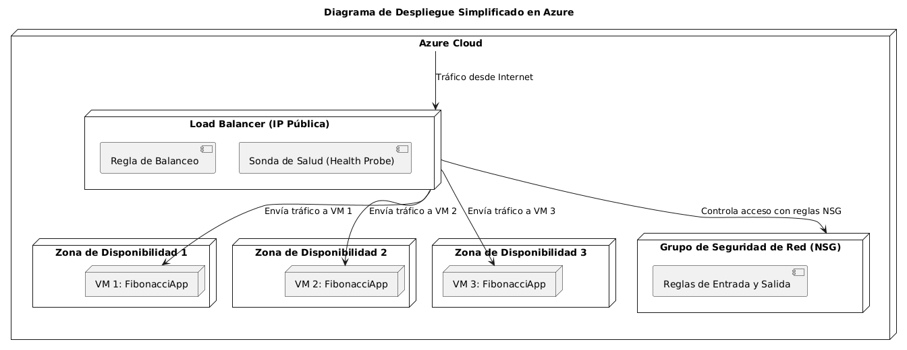
 


